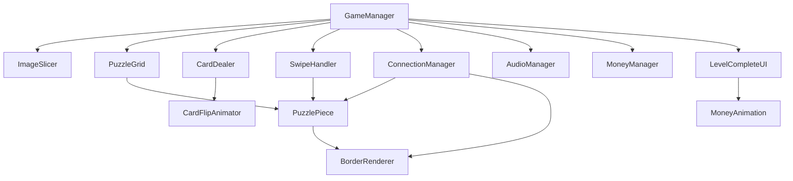

# План реализации механики пазла

## Архитектура системы




## Структура файлов

### Core Scripts

- `Assets/Scripts/Core/GameManager.cs` - Главный менеджер игры, координация всех систем
- `Assets/Scripts/Core/PuzzleGrid.cs` - Управление сеткой n×k, расчет позиций, размеров
- `Assets/Scripts/Core/PuzzlePiece.cs` - Класс карточки пазла (индекс, позиция, состояние, спрайты)

### Image Processing

- `Assets/Scripts/ImageProcessing/ImageSlicer.cs` - Разрезание спрайта на n×k частей, создание массива спрайтов с индексами

### Animations

- `Assets/Scripts/Animations/CardDealer.cs` - Плавное перемещение карточек из колоды на поле (последовательно)
- `Assets/Scripts/Animations/CardFlipAnimator.cs` - Анимация переворота через scale.x (1→0→1) с заменой спрайта
- `Assets/Scripts/Animations/MoneyAnimation.cs` - Анимация монеток от кнопки Next к точке purpose

### Gameplay

- `Assets/Scripts/Gameplay/SwipeHandler.cs` - Обработка свайпов (нажатие, перемещение, отпускание), определение групп соединенных карточек
- `Assets/Scripts/Gameplay/ConnectionManager.cs` - Проверка соединений карточек, обновление границ рамок
- `Assets/Scripts/Gameplay/BorderRenderer.cs` - Управление 4 частями рамки (верх, низ, лево, право), включение/выключение границ

### UI

- `Assets/Scripts/UI/LevelCompleteUI.cs` - Панель завершения уровня, кнопка Next, текст "Level Completed"
- `Assets/Scripts/UI/MoneyDisplay.cs` - Отображение счета денег на экране

### Managers

- `Assets/Scripts/Managers/AudioManager.cs` - Управление звуками (раздача, переворот, свайп, победа)
- `Assets/Scripts/Managers/MoneyManager.cs` - Управление деньгами (счет, начисление, сохранение в PlayerPrefs)
- `Assets/Scripts/Managers/ConfettiEffect.cs` - Заглушка для эффекта конфетти (пустая функция)

## Детальная реализация

### 1. GameManager.cs

**Параметры в инспекторе:**

- `sourceImage` (Sprite) - исходное изображение для пазла
- `cardBackSprite` (Sprite) - спрайт обратной стороны карточки
- `borderSprite` (Sprite) - спрайт рамки (прозрачная середина, рамка по краям)
- `gridRows` (int) - n (количество строк)
- `gridCols` (int) - k (количество столбцов)
- `fieldWidth` (float) - n1 (ширина поля)
- `fieldHeight` (float) - k1 (высота поля)
- `cardSpacing` (float) - отступ между карточками
- `deckPosition` (Vector2) - позиция колоды (правый нижний угол)
- `moneyTargetPosition` (Vector2) - точка purpose для монеток
- `dealDelay` (float) - задержка между раздачей карточек
- `flipDelay` (float) - задержка между переворотами

**Функционал:**

- Инициализация всех систем
- Запуск последовательности: разрезание → раздача → переворот
- Проверка победы (сравнение текущего расположения с правильным)
- Обработка завершения уровня

### 2. ImageSlicer.cs

**Методы:**

- `SliceImage(Sprite source, int rows, int cols)` - разрезание на части
- `GetSpriteAt(int row, int col)` - получение спрайта по координатам
- Создание индексов: `int index = row * cols + col` (одномерная нумерация 0, 1, 2...)

**Реализация:**

- Использование `Texture2D.ReadPixels()` для создания отдельных текстур
- Создание спрайтов через `Sprite.Create()`
- Хранение в массиве `Sprite[,] `или `List<Sprite>` с индексацией

### 3. PuzzleGrid.cs

**Параметры:**

- `gridRows`, `gridCols` - размеры сетки
- `fieldWidth`, `fieldHeight` - размеры поля
- `cardSpacing` - отступы

**Методы:**

- `CalculateCardSize()` - размер карточки = (fieldWidth/gridCols - spacing) × (fieldHeight/gridRows - spacing)
- `GetWorldPosition(int row, int col)` - расчет позиции в мировых координатах
- `GetGridPosition(Vector2 worldPos)` - обратное преобразование
- `FindNearestEmptyCell(Vector2 position)` - поиск ближайшей пустой ячейки
- `GetEmptyCells()` - список пустых ячеек

**Система координат:**

- Левый верхний угол = (0, 0) для простоты
- Расчет от центра поля или от левого верхнего угла

### 4. PuzzlePiece.cs

**Поля:**

- `originalIndex` (int) - индекс в правильном расположении (0..n*k-1)
- `currentGridRow`, `currentGridCol` (int) - текущая позиция на сетке
- `isFlipped` (bool) - перевернута ли карточка
- `frontSprite`, `backSprite` (Sprite) - спрайты
- `borderParts` (GameObject[4]) - 4 части рамки (верх, низ, лево, право)
- `isConnected` (bool[4]) - соединения со всех сторон

**Методы:**

- `SetPosition(int row, int col)` - установка позиции на сетке
- `GetOriginalPosition()` - получение правильной позиции из originalIndex
- `Flip()` - переворот карточки

### 5. CardDealer.cs

**Методы:**

- `DealCards(List<PuzzlePiece> pieces)` - последовательная раздача
- Использование DOTween для плавного перемещения
- Заполнение слева направо, сверху вниз
- Звук при каждой раздаче (вызов AudioManager)

**Анимация:**

- `transform.DOMove(targetPosition, duration).SetEase(Ease.OutQuad)`

### 6. CardFlipAnimator.cs

**Методы:**

- `FlipCard(PuzzlePiece piece)` - переворот одной карточки
- `FlipAllCards(List<PuzzlePiece> pieces)` - последовательный переворот всех

**Анимация:**

- `transform.DOScaleX(0, 0.15f).OnComplete(() => { ChangeSprite(); transform.DOScaleX(1, 0.15f); })`
- Замена спрайта в момент scale.x = 0

### 7. SwipeHandler.cs

**Параметры:**

- `swipeThreshold` (float) - минимальное расстояние для свайпа

**Методы:**

- `OnPointerDown()` - определение начальной карточки
- `OnDrag()` - перемещение карточки/группы
- `OnPointerUp()` - поиск ближайшей ячейки, размещение
- `FindConnectedGroup(PuzzlePiece startPiece)` - поиск всех соединенных карточек (BFS/DFS)
- `MoveGroupToPosition(List<PuzzlePiece> group, Vector2 targetPos)` - перемещение группы
- `ShiftOtherPieces()` - смещение остальных карточек в пустые места

**Логика групп:**

- Рекурсивный поиск всех соединенных карточек
- Сохранение относительных позиций при перемещении группы

### 8. ConnectionManager.cs

**Методы:**

- `CheckAllConnections()` - проверка всех карточек на поле
- `CheckPieceConnections(PuzzlePiece piece)` - проверка одной карточки
- `UpdateBorderVisibility(PuzzlePiece piece)` - обновление видимости границ

**Алгоритм проверки:**

- Для каждой карточки: получить правильную позицию из originalIndex
- Проверить соседей в правильном расположении (originalIndex ±1, ±cols)
- Если сосед на поле и рядом - скрыть границу
- Обновить BorderRenderer для всех 4 сторон

### 9. BorderRenderer.cs

**Структура:**

- Рамка разрезается на 4 части по диагоналям (верх, низ, лево, право)
- Каждая часть - отдельный GameObject с SpriteRenderer
- Методы включения/выключения каждой части

**Методы:**

- `SetBorderActive(int side, bool active)` - side: 0=верх, 1=низ, 2=лево, 3=право
- `UpdateBorders(PuzzlePiece piece, bool[] connections)` - обновление всех границ

### 10. AudioManager.cs

**Параметры:**

- `cardDealClip` (AudioClip)
- `cardFlipClip` (AudioClip)
- `swipeClip` (AudioClip)
- `levelCompleteClip` (AudioClip)
- `audioSource` (AudioSource)

**Методы:**

- `PlayCardDeal()`, `PlayCardFlip()`, `PlaySwipe()`, `PlayLevelComplete()`

### 11. MoneyManager.cs

**Параметры:**

- `currentMoney` (int) - текущий счет
- `moneyKey` (string) = "PlayerMoney" - ключ PlayerPrefs

**Методы:**

- `AddMoney(int amount)` - начисление денег
- `GetMoney()` - получение счета
- `SaveMoney()` - сохранение в PlayerPrefs
- `LoadMoney()` - загрузка из PlayerPrefs

### 12. LevelCompleteUI.cs

**Элементы UI:**

- Панель завершения (Canvas Group для fade)
- Текст "Level Completed"
- Кнопка Next
- Префаб монетки для анимации

**Методы:**

- `ShowLevelComplete()` - показ панели
- `OnNextButtonClick()` - запуск анимации монеток, затем addMoney(15)
- `AnimateCoins(int count)` - создание монеток, анимация к purpose

### 13. MoneyAnimation.cs

**Методы:**

- `AnimateToTarget(Vector2 targetPosition)` - плавное перемещение монетки к цели
- Использование DOTween: `transform.DOMove(target, duration).OnComplete(() => Destroy())`

### 14. MoneyDisplay.cs

**Функционал:**

- Отображение счета денег на экране
- Обновление при изменении через MoneyManager

## Порядок реализации

1. **Базовая структура** (GameManager, PuzzleGrid, PuzzlePiece)
2. **Разрезание изображения** (ImageSlicer) - тест на простом спрайте
3. **Раздача карточек** (CardDealer) - базовая анимация перемещения
4. **Переворот** (CardFlipAnimator) - анимация scale.x
5. **Свайп механика** (SwipeHandler) - базовое перемещение одной карточки
6. **Группы карточек** - расширение SwipeHandler для групп
7. **Соединения** (ConnectionManager, BorderRenderer) - проверка и визуализация
8. **Смещение карточек** - логика заполнения пустых мест
9. **Звуки** (AudioManager) - интеграция всех звуков
10. **UI завершения** (LevelCompleteUI, MoneyAnimation) - панель и анимация монеток
11. **Монетки** (MoneyManager, MoneyDisplay) - система денег
12. **Оптимизация** - object pooling, кэширование проверок

## Технические детали

### Оптимизация для WebGL

- Object pooling для карточек и монеток
- Кэширование результатов проверки соединений
- Минимизация вызовов Update() - использование событий
- Оптимизация спрайтов (Sprite Atlas)
- Сжатие аудио (MP3 с низким битрейтом)

### Зависимости

- DOTween (установить через Package Manager: `com.demigiant.dotween`)
- Unity 2D Sprite система
- UI Canvas для интерфейса

### Система координат

- Использование Screen Space - Overlay для UI
- World Space для игрового поля
- Расчет позиций относительно центра камеры или фиксированной точки

### Рандомизация

- Перемешивание массива индексов перед созданием карточек: `System.Linq.OrderBy(x => Random.value)`

## Структура папок

```javascript
Assets/
├── Scripts/
│   ├── Core/
│   ├── ImageProcessing/
│   ├── Animations/
│   ├── Gameplay/
│   ├── UI/
│   └── Managers/
├── Sprites/
│   ├── PuzzleImages/
│   ├── CardBack/
│   ├── Borders/
│   └── UI/
├── Audio/
│   ├── CardDeal.mp3
│   ├── CardFlip.mp3
│   ├── Swipe.mp3
│   └── LevelComplete.mp3
└── Prefabs/
    ├── PuzzlePiece.prefab
    ├── BorderPart.prefab
    └── Coin.prefab
```


## Ключевые алгоритмы

### Поиск группы соединенных карточек

```csharp
List<PuzzlePiece> FindConnectedGroup(PuzzlePiece start) {
    HashSet<PuzzlePiece> visited = new HashSet<PuzzlePiece>();
    Queue<PuzzlePiece> queue = new Queue<PuzzlePiece>();
    queue.Enqueue(start);
    visited.Add(start);
    
    while (queue.Count > 0) {
        PuzzlePiece current = queue.Dequeue();
        foreach (PuzzlePiece neighbor in GetConnectedNeighbors(current)) {
            if (!visited.Contains(neighbor)) {
                visited.Add(neighbor);
                queue.Enqueue(neighbor);
            }
        }
    }
    return visited.ToList();
}
```


### Проверка соединения

```csharp
bool AreConnected(PuzzlePiece a, PuzzlePiece b) {
    int aRow = a.originalIndex / gridCols;
    int aCol = a.originalIndex % gridCols;
    int bRow = b.originalIndex / gridCols;
    int bCol = b.originalIndex % gridCols;
    
    // Проверка соседства в оригинале
    bool horizontallyAdjacent = aRow == bRow && Mathf.Abs(aCol - bCol) == 1;
    bool verticallyAdjacent = aCol == bCol && Mathf.Abs(aRow - bRow) == 1;
    
    // Проверка соседства на поле
    bool onFieldAdjacent = Mathf.Abs(a.currentGridRow - b.currentGridRow) + 
                          Mathf.Abs(a.currentGridCol - b.currentGridCol) == 1;
    
    return (horizontallyAdjacent || verticallyAdjacent) && onFieldAdjacent;
}
```


## Необходимые настройки

1. Установить DOTween через Package Manager
2. Настроить Audio Source на GameManager или отдельном объекте
3. Создать Canvas для UI (Screen Space - Overlay)
4. Настроить Camera для 2D (Orthographic)